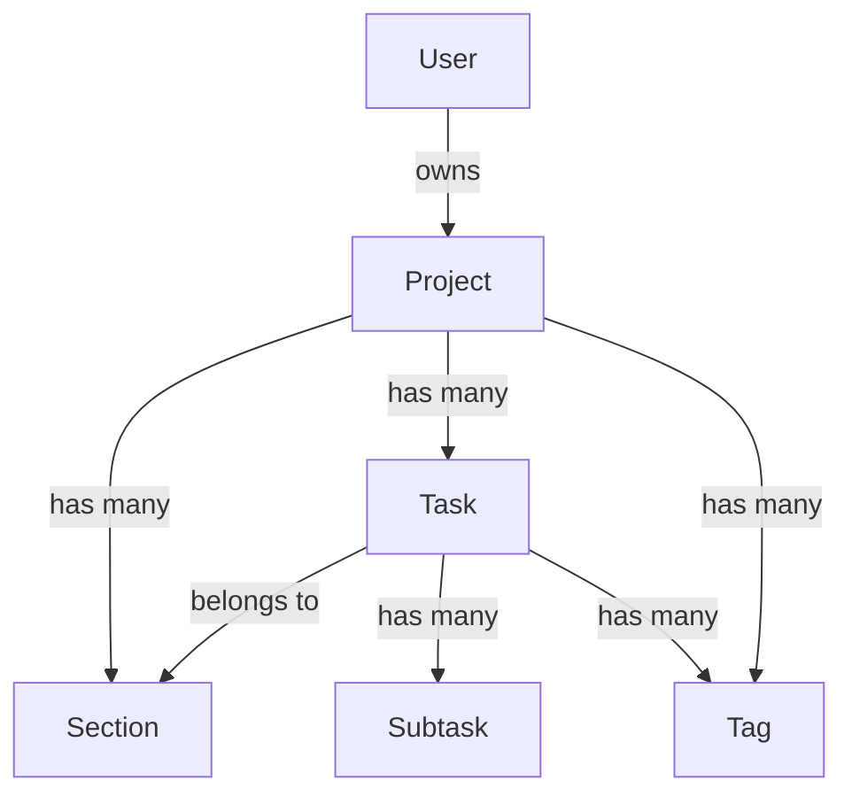

# Seed Data Workflow

This workflow populates the Firebase Firestore database with realistic test data.

## Prerequisites

- Firebase project must be configured
- User must be authenticated in the app
- Firestore security rules must allow writes

## Workflow Steps

### 1. Check Existing Seed Service

The app has a seed data service at:
`src/app/core/services/seed-data.service.ts`

### 2. Verify Authentication

Ensure user is logged in before seeding:
- Open app at `http://localhost:4200`
- Sign in with test account
- Check auth state in browser console

### 3. Trigger Seed via Browser Console

```javascript
// In browser dev tools console
const seedService = await import('/src/app/core/services/seed-data.service');
// Or call the seed button in the UI if available
```

### 4. Sample Data Structure

#### Projects

```typescript
const sampleProjects = [
  {
    name: 'Website Redesign',
    description: 'Complete overhaul of company website',
    color: '#8b5cf6',
    status: 'active',
    sections: [
      { id: 'todo', name: 'To Do', order: 0 },
      { id: 'in-progress', name: 'In Progress', order: 1 },
      { id: 'review', name: 'Review', order: 2 },
      { id: 'done', name: 'Done', order: 3 },
    ],
    tags: [
      { id: 'design', name: 'Design', color: '#06b6d4' },
      { id: 'frontend', name: 'Frontend', color: '#3b82f6' },
      { id: 'urgent', name: 'Urgent', color: '#ef4444' },
    ],
  },
  {
    name: 'Mobile App Development',
    description: 'iOS and Android companion app',
    color: '#3b82f6',
    status: 'active',
    sections: [
      { id: 'backlog', name: 'Backlog', order: 0 },
      { id: 'sprint', name: 'Current Sprint', order: 1 },
      { id: 'testing', name: 'Testing', order: 2 },
      { id: 'released', name: 'Released', order: 3 },
    ],
  },
  {
    name: 'Q1 Marketing Campaign',
    description: 'Marketing initiatives for Q1 2026',
    color: '#10b981',
    status: 'active',
  },
];
```

#### Tasks

```typescript
const sampleTasks = [
  {
    title: 'Design new homepage layout',
    description: 'Create wireframes and mockups for the homepage redesign',
    priority: 'high',
    status: 'in-progress',
    tags: ['design', 'urgent'],
    dueDate: new Date('2026-02-01'),
    subtasks: [
      { title: 'Research competitor designs', completed: true },
      { title: 'Create wireframes', completed: true },
      { title: 'Design high-fidelity mockups', completed: false },
      { title: 'Get stakeholder approval', completed: false },
    ],
  },
  {
    title: 'Implement user authentication',
    description: 'Add Firebase Auth with Google and email/password login',
    priority: 'high',
    status: 'done',
    tags: ['frontend'],
  },
  {
    title: 'Set up CI/CD pipeline',
    description: 'Configure GitHub Actions for automatic deployment',
    priority: 'medium',
    status: 'done',
  },
  // ... more tasks
];
```

### 5. Verify Data in Firestore

```bash
# Open Firebase Console
// turbo
start https://console.firebase.google.com/project/omnitask-475422/firestore
```

Check:
- `projects` collection has sample projects
- `tasks` collection has sample tasks with correct `projectId` references
- Task ordering is correct within sections

### 6. Clear Seed Data (if needed)

To remove seed data for a fresh start:

```typescript
// In seed-data.service.ts
async clearAllData(): Promise<void> {
  const batch = writeBatch(this.firestore);
  // Delete all tasks
  // Delete all projects
  await batch.commit();
}
```

## Data Relationships



## Troubleshooting

| Issue | Solution |
|-------|----------|
| Permission denied | Check Firestore security rules |
| Missing user ID | Ensure user is authenticated |
| Duplicate IDs | Clear existing data first |
| Tasks not visible | Check projectId matches |
