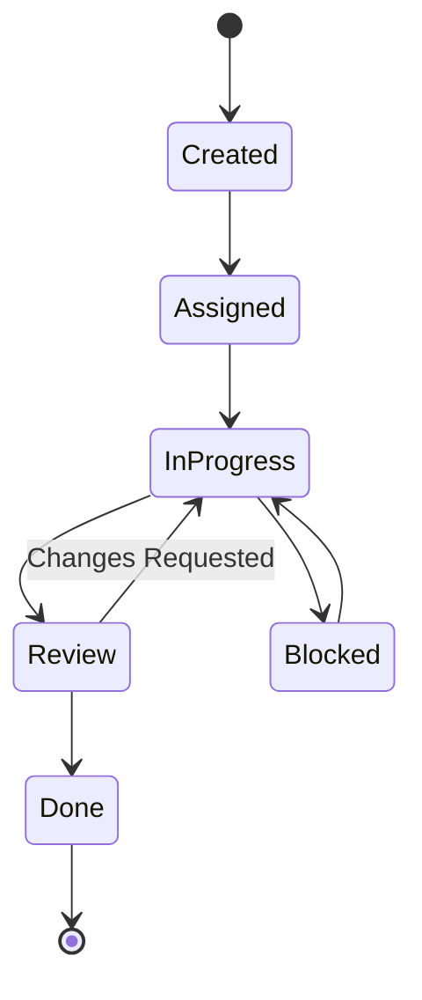

# Task Management Domain Context

This document provides deep context about the task management domain for OmniTask.

## Task Lifecycle



## Core Entities

### Task

The primary unit of work in OmniTask.

```typescript
interface Task {
  id: string;
  projectId: string;
  sectionId?: string;        // For board view placement
  parentTaskId?: string;     // For subtask relationships
  
  // Content
  title: string;
  description?: string;      // Markdown supported
  
  // Assignment
  assignedToId?: string;
  createdById: string;
  
  // Status & Priority
  status: 'todo' | 'in-progress' | 'blocked' | 'done';
  priority: 'low' | 'medium' | 'high';
  
  // Scheduling
  startDate?: Date;
  dueDate?: Date;
  dueTime?: string;          // HH:mm format
  
  // Organization
  tags?: string[];
  order: number;             // For drag-and-drop ordering
  
  // Relationships
  subtasks?: Subtask[];
  dependencies?: string[];   // Task IDs this task depends on
  
  // Metadata
  createdAt: Date;
  updatedAt: Date;
  completedAt?: Date;
}
```

### Subtask

Lightweight task nested within a parent task.

```typescript
interface Subtask {
  id: string;
  title: string;
  completed: boolean;
  order: number;
  completedAt?: Date;
}
```

## Section/Kanban Board Behavior

Sections represent columns in board view:

```typescript
interface Section {
  id: string;
  name: string;
  order: number;
  color?: string;
  isDefault?: boolean;  // New tasks go here
}
```

### Default Sections

New projects get these default sections:
1. **To Do** (order: 0, isDefault: true)
2. **In Progress** (order: 1)
3. **Done** (order: 2)

### Task Movement Rules

- Moving task between sections updates `sectionId` and `order`
- Moving to "Done" section sets `status: 'done'` and `completedAt`
- Moving from "Done" clears `completedAt` and sets `status: 'in-progress'`
- Order is recalculated for all tasks in affected sections

## Drag-and-Drop Ordering

### Order Calculation

Uses gap-based ordering for efficient reordering:

```typescript
// When inserting between tasks with orders 1.0 and 2.0
const newOrder = (1.0 + 2.0) / 2; // = 1.5

// When moving to end
const newOrder = lastTaskOrder + 1.0;

// When moving to start
const newOrder = firstTaskOrder - 1.0;
```

### Batch Updates

Moving one task requires updating multiple tasks:

```typescript
async reorderTasksInSection(sectionId: string, taskOrders: Map<string, number>) {
  const batch = writeBatch(firestore);
  for (const [taskId, order] of taskOrders) {
    batch.update(doc(firestore, `tasks/${taskId}`), { order, updatedAt: new Date() });
  }
  await batch.commit();
}
```

## Priority System

| Priority | Color | Urgency | Typical Due |
|----------|-------|---------|-------------|
| High | Red `#ef4444` | Immediate | Today/Tomorrow |
| Medium | Orange `#f59e0b` | This week | 3-7 days |
| Low | Gray `#6b7280` | Flexible | 1-2 weeks+ |

## Tag System

Tags are project-scoped and color-coded:

```typescript
interface Tag {
  id: string;
  name: string;
  color: string;  // Hex color
}
```

### Common Tag Patterns

- **Bug** (red) - Issues to fix
- **Feature** (purple) - New functionality
- **Design** (cyan) - UI/UX work
- **Urgent** (red) - Time-sensitive
- **Blocked** (gray) - Waiting on something

## Filtering & Sorting

### Common Filters

```typescript
// My tasks
where('assignedToId', '==', currentUserId)

// Due this week
where('dueDate', '>=', startOfWeek)
where('dueDate', '<=', endOfWeek)

// High priority incomplete
where('priority', '==', 'high')
where('status', '!=', 'done')

// By tag
where('tags', 'array-contains', tagId)
```

### Sort Options

- **Due Date** - Ascending (soonest first)
- **Priority** - High → Medium → Low
- **Created** - Newest first
- **Alphabetical** - A-Z by title
- **Custom** - Manual order

## Real-Time Updates

Tasks use Firestore real-time listeners:

```typescript
const tasksQuery = query(
  collection(firestore, 'tasks'),
  where('projectId', '==', projectId),
  orderBy('order', 'asc')
);

collectionData(tasksQuery, { idField: 'id' })
  .pipe(takeUntilDestroyed())
  .subscribe(tasks => this.tasks.set(tasks));
```

## Integration Points

### Calendar View

Tasks with `dueDate` appear on the calendar:
- **Full day** - No `dueTime` set
- **Timed** - Has `dueTime`
- **Multi-day** - Has `startDate` and `dueDate`

### Board View

Tasks grouped by `sectionId`, ordered by `order` within section.

### List View

Flat list of tasks, customizable sorting and filtering.
