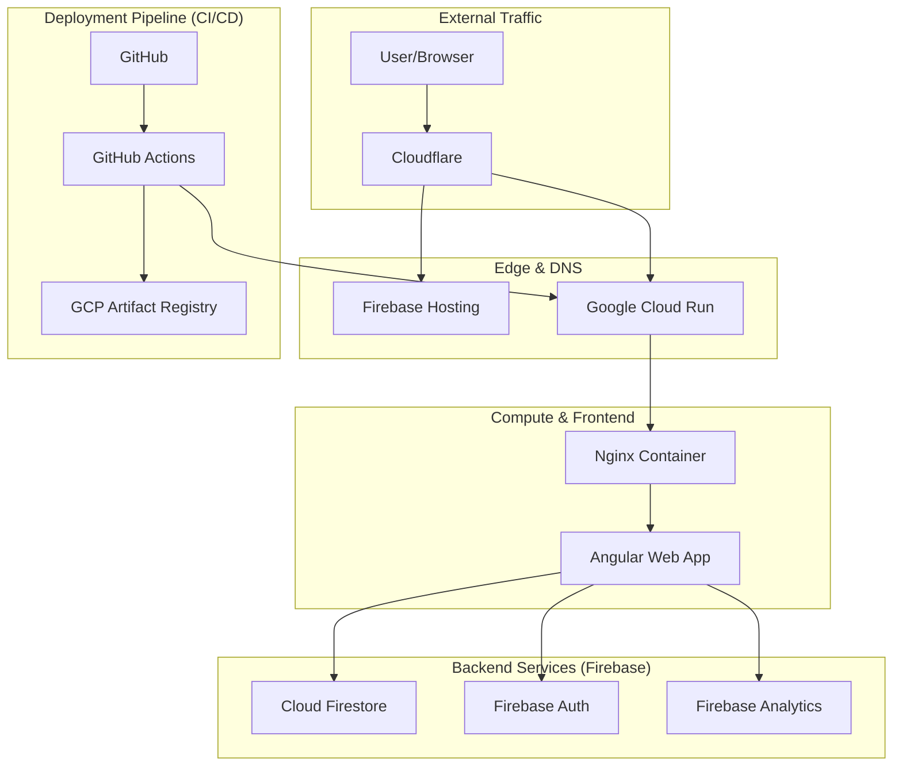

# Deployment & Architecture Overview

This document explains the technical architecture of OmniTask and how various cloud services interact to provide a high-performance, secure, and scalable application.

## High-Level Architecture

The OmniTask ecosystem leverages a modern, distributed architecture where each component is optimized for a specific role:

---

## Component Responsibilities

### 1. GitHub (The Source of Truth & CI/CD)

GitHub hosts the code repository and manages the automation pipeline.

- **Source Control**: Manages code versions and branches (e.g., `live` branch).
- **GitHub Actions**: Executes the deployment workflow defined in `.github/workflows/deploy-cloudrun.yml`.
  - Authenticates to GCP via **Workload Identity Federation** (no static keys).
  - Builds the production Docker image.
  - Pushes images to the GCP Artifact Registry.
  - Triggers the deployment to Google Cloud Run.

### 2. Google Cloud Platform (The Compute Engine)

GCP provides the heavy lifting for running the application container.

- **Artifact Registry**: A secure, private registry for storing your application's Docker images.
- **Google Cloud Run**: A fully managed serverless platform that runs your container:
  - Automatically scales based on traffic.
  - Runs the Nginx-based container which serves the Angular frontend.
  - Provides a direct `*.run.app` URL for the service.

### 3. Firebase (The Backend-as-a-Service)

Firebase simplifies backend logic and provides real-time capabilities.

- **Cloud Firestore**: A NoSQL database that stores all application data with real-time sync.
- **Firebase Authentication**: Handles secure user sign-in and identity management.
- **Firebase Hosting**: Can be used for static asset hosting and managing SEO-friendly rewrites.
- **Firebase Analytics**: Tracks user engagement and application performance.

### 4. Cloudflare (The Edge Layer)

Cloudflare sits in front of everything to provide security and performance.

- **DNS Management**: Manages the `omniflexfitness.com` domain and `task` subdomain.
- **SSL/TLS**: Ensures all traffic is encrypted.
- **CDN / Caching**: Caches static assets at the edge to reduce latency.
- **WAF (Web Application Firewall)**: Protects the app from DDoS attacks and common web vulnerabilities.

---

## Required GitHub Secrets

Before deploying, ensure the following secrets are configured in your GitHub repository settings (Settings > Secrets and variables > Actions):

| Secret Name | Description | How to Obtain |
| :--- | :--- | :--- |
| `GCP_PROJECT_NUMBER` | Your GCP project number | GCP Console > Project Settings |

**Note:** Firebase deployment uses Google Cloud Application Default Credentials (ADC) via Workload Identity Federation. No separate Firebase token is required.

---

## Deployment Flow

1. **Commit**: A developer pushes code to the `live` branch on GitHub.
2. **Build Docker**: GitHub Actions builds the Angular app inside a Docker container.
3. **Containerize**: The build artifacts are packaged into a Docker image using the `Dockerfile`.
4. **Register**: The image is uploaded to GCP Artifact Registry.
5. **Deploy Cloud Run**: Cloud Run pulls the new image and starts a zero-downtime deployment.
6. **Build Angular**: Node.js is set up and the Angular app is built again for Firebase.
7. **Deploy Firebase**: Firebase Hosting and Firestore rules are deployed via `firebase-tools`.
8. **Tag Release**: A new version tag is created and pushed to the repository.

---

## Interaction Summary

| Service | Primary Role | Interacts With |
| :--- | :--- | :--- |
| **GitHub** | CI/CD & Automation | GCP Artifact Registry, Cloud Run |
| **Cloudflare** | Edge & DNS | Cloud Run / Firebase Hosting |
| **GCP Cloud Run** | Container Hosting | Nginx, Angular |
| **Firebase** | Backend Services | Angular (Client-side) |
